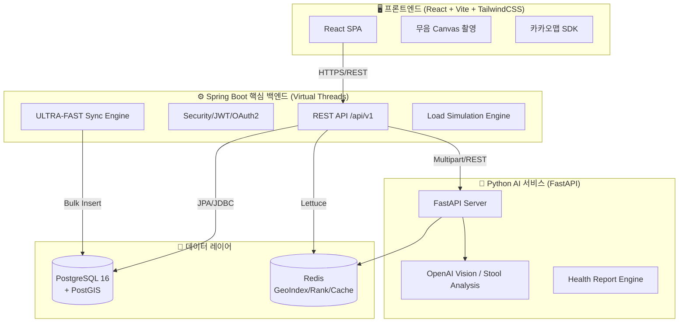

# DayPoo

<div align="center">

**대한민국 스마트한 배변 문화를 위한 공간 정보 및 AI 분석 서비스**

_React · Spring Boot 3.4 (Virtual Threads) · Python/FastAPI · OpenAI Vision_

[](https://github.com/jhyeon9185/daypoo)
[](./frontend)
[](./backend)
[](./ai-service)
[](./LICENSE)

**원본 팀 프로젝트**: [jhyeon9185/daypoo](https://github.com/jhyeon9185/daypoo)

</div>

---

## 📌 이 레포지토리의 목적

본 레포지토리는 3인 팀 프로젝트로 진행되었던 'DayPoo'의 코드를 기반으로, **개인 포트폴리오 및 발표 준비를 위해 단독으로 포크하여 리팩토링 및 기능을 개선하고 있는 개인 작업 공간**입니다.

기존 팀 협업을 통해 완성된 초기 아키텍처를 바탕으로, 현재는 코드 품질 향상, 구조 최적화 및 추가 기능 고도화 작업을 개별적으로 진행하고 있습니다.

---

## 📖 프로젝트 소개

**DayPoo**는 대한민국 화장실 정보를 지도 위에 시각화하고, 사용자의 배변 기록을 AI로 분석하여 생활 습관 인사이트를 제공하는 위치 기반 서비스입니다.

전국 약 5만 건의 공공데이터를 Java 21 가상 스레드(Virtual Threads) 기반 엔진으로 초고속 동기화하며, PostGIS 공간 쿼리와 OpenAI Vision 기반의 분석 리포팅 시스템을 통해 실용적인 사용자 경험을 제공합니다.

---

## 🙋‍♂️ 개인 기여 및 담당 역할

> 기존 팀 프로젝트에서 본인이 전담하여 구축한 핵심 도메인과 향후 진행할 리팩토링 계획입니다.

### 👥 팀 프로젝트 주요 기여 (인증/결제/인프라)

- **인증 및 보안 (Auth & Security)**: JWT 및 OAuth2 기반의 안전한 사용자 인증·인가 체계 설계 및 구현
- **결제 도메인 (Payments)**: 서비스 내 핵심 결제 비즈니스 로직 설계 및 연동
- **인프라 (Infrastructure)**: 클라우드 서버 자원 프로비저닝 및 프로젝트 배포·운영 환경 구축

### 🧑‍💻 리팩토링 및 고도화 진행 (현재 단계)

- 단독 포크 및 환경 설정 완료, 본격적인 코드 품질 개선 작업 착수
- (이후 리팩토링 및 아키텍처 개선 사항을 순차적으로 기록할 예정입니다.)

---

## 🏗️ 시스템 아키텍처

DayPoo는 고성능 데이터 처리와 AI 확장을 위해 **서비스 지향 아키텍처(SOA)**를 채택하였습니다.



---

## 🛠️ 기술 스택 (Technology Stack)

| 파트           | 기술                        | 설명                                                      |
| :------------- | :-------------------------- | :-------------------------------------------------------- |
| **Frontend**   | React 19.2, TypeScript, Vite | WebRTC 기반 무음 캡처 및 고성능 지도 UI 구현 (Port: 5173) |
| **Backend**    | Spring Boot 3.4.3 (Java 21) | **가상 스레드(Virtual Threads)** 기반 고성능 병렬 처리    |
|                | QueryDSL 5.0 / Flyway       | 타입 세이프한 쿼리 작성 및 DB 형상 관리 자동화            |
| **AI Service** | FastAPI (Python 3.12)       | **In-Memory Pipeline** 기반 무저장 이미지 분석            |
|                | OpenAI GPT-4o Vision        | 브리스톨 척도 및 배변 패턴 정밀 분석                      |
| **Data Layer** | PostgreSQL 16 + PostGIS     | 5만 건 공간 데이터 처리 및 공간 인덱싱(GIST)              |
|                | Redis (Geo, ZSET, Cache)    | **지역별 실시간 랭킹** 및 JWT 세션 관리                   |
| **DevOps**     | Terraform (IaC), Docker     | 코드형 인프라 관리 및 컨테이너 기반 운영                  |

---

## ✨ 핵심 차별점 (Core Strengths)

### 1. 🚀 가상 스레드 기반 동기화 및 시뮬레이션

- **동기화 엔진**: 5만 건 이상의 데이터를 수 분 내에 동기화하는 가상 스레드 기반 배치 프로세스.
- **시뮬레이션 모드**: 수만 명의 가상 유저와 수십만 개의 배변 기록을 생성하여 부하를 테스트하는 엔진 내장.

### 2. 🛡️ 보안 및 개인정보 보호 (Privacy-First)

- **무저장 AI 분석**: 배변 이미지를 서버 DB에 저장하지 않고 AI 분석 즉시 메모리에서 폐기하여 민감 정보 보호.
- **Maintenance Filter**: 시스템 점검 시 어드민을 제외한 접근을 일괄 제어하는 전역 필터 적용.

### 3. 🗺️ 정밀 공간 데이터 처리

- **PostGIS 최적화**: 단순 거리 계산을 넘어 `Geography` 타입을 활용한 정밀한 위치 검증 및 근처 화장실 추천.

---

## 🏁 원본 프로젝트 안내

초기 설정, 포크 워크플로우 등 팀 프로젝트 온보딩 가이드 및 협업 규칙은 원본 레포지토리를 참고해 주세요.

- **원본 레포지토리**: [jhyeon9185/daypoo](https://github.com/jhyeon9185/daypoo)

---

## 🚀 시작하기 (Quick Start)

### 1단계: 환경 설정

프로젝트 루트의 `.env` 파일을 작성합니다.

```bash
cp .env.example .env
# DB_HOST, JWT_SECRET_KEY, OPENAI_API_KEY 등 필수값 기입
```

### 2단계: 로컬 개발 실행

- **Docker** (DB/인프라): `docker-compose up -d`
- **Backend**: `cd backend && ./gradlew bootRun` (URL: `http://localhost:8080`)
- **AI Service**: `cd ai-service && python main.py` (URL: `http://localhost:8000`)
- **Frontend**: `cd frontend && npm install && npm run dev` (URL: `http://localhost:5173`)

> 순서대로 실행 권장 — Docker(DB) → Backend → AI Service → Frontend

---

## 📁 디렉토리 구조

```text
daypoo/
├── frontend/             # React + Vite SPA
├── backend/              # Spring Boot 3.4.3 (Core Business Logic)
├── ai-service/           # FastAPI AI Microservice (Python)
├── terraform/            # Infrastructure as Code (AWS)
├── docs/                 # 통합 문서 저장소
├── scripts/              # 유틸리티 및 배포 스크립트
└── docker-compose.yml    # 로컬 인프라 (PostgreSQL, Redis)
```

---

## 📅 마일스톤 (Milestones)

### 👥 팀 프로젝트 단계

- **✅ 2026.03.18 - 가상 스레드 기반 5만 건 초고속 동기화 엔진 구축 완료**

### 🧑‍💻 개인 리팩토링 및 고도화 단계

- **✅ 2026.03.20 - 프로젝트 전체 개선 계획 수립 및 착수**
- **✅ 2026.03.28 - 마이페이지 UI 스케일 업 및 리팩토링 완료**
- **✅ 2026.04.01 - 백엔드 상세 설계(v1.5) 및 API 명세서(Swagger 2.8.5) 최적화**
- **✅ 2026.04.02 - 프로젝트 문서 체계 통합 및 고도화 완료**
- **✅ 2026.04.02 - 프론트엔드/백엔드 아키텍처 동기화 및 설계서 전면 개정**

---

## 📄 라이선스

이 프로젝트는 [ISC License](./LICENSE)를 따릅니다.

---
> 최종 업데이트: 2026-07-05 17:53 (KST)
