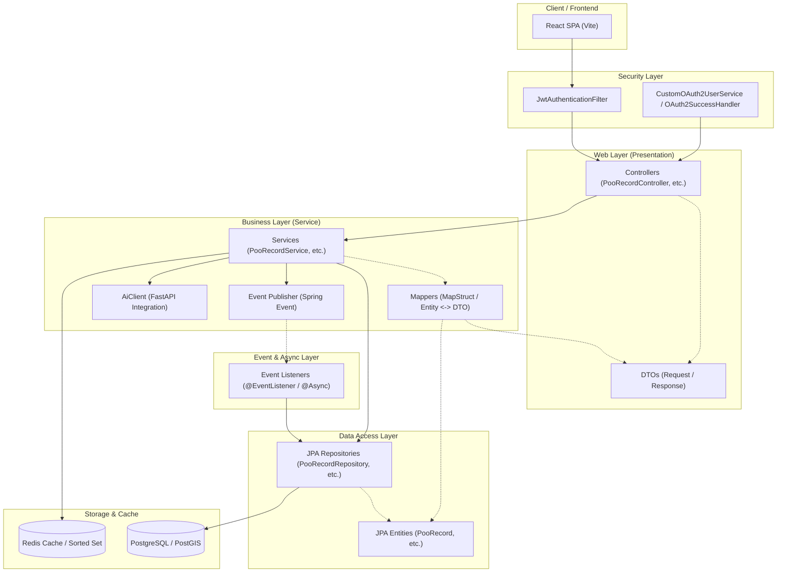
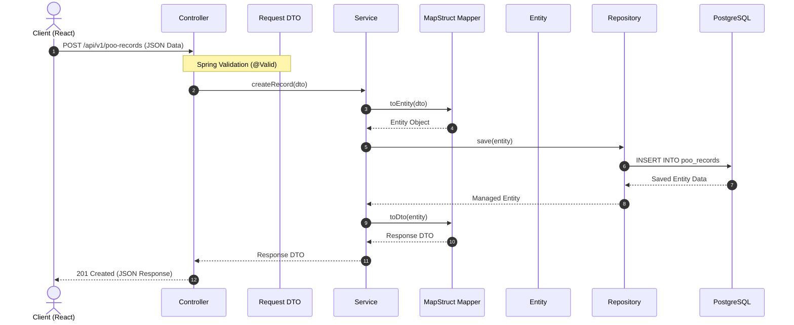

# ⚙️ DayPoo 프로젝트 아키텍처 블루프린트 (Project Architecture Blueprint)

본 문서는 DayPoo 프로젝트의 전반적인 시스템 아키텍처 및 특히 **Spring Boot 백엔드 애플리케이션의 계층 구조와 의존성 흐름**을 상세히 정의합니다. 본 문서는 아키텍처의 일관성을 유지하고 향후 신규 개발 시 가이드라인 역할을 하기 위해 작성되었습니다.

---

## 1. 아키텍처 개요 (Architectural Overview)

DayPoo 백엔드는 **계층형 아키텍처(Layered Architecture)** 패턴을 채택하고 있습니다. 각 계층은 명확한 책임과 경계를 가지며, 의존성은 상위 계층에서 하위 계층으로만 흐르는 단방향 원칙을 엄격하게 준수합니다.

```
[ Presentation Layer ] (Controller, DTO)
         │
         ▼
[ Business Logic Layer ] (Service, Mapper, Event, Component)
         │
         ▼
[ Data Access Layer ] (Repository, Entity)
         │
         ▼
[ Database / Cache ] (PostgreSQL, Redis)
```

### 아키텍처 설계 원칙

1. **단방향 의존성**: 의존성은 `Controller -> Service -> Repository -> Entity/Database` 방향으로만 흐르며 역방향 의존성이나 순환 의존성은 허용되지 않습니다.
2. **책임의 분리 (SOC)**: HTTP 요청 처리, 비즈니스 로직 연산, 데이터베이스 쿼리는 각각의 전용 계층에서 전담합니다.
3. **영속성 객체 격리**: 엔티티(Entity) 객체가 프레젠테이션 계층(Controller/View)까지 노출되지 않도록 하며, 데이터 송수신에는 반드시 DTO(Data Transfer Object)를 사용합니다.
4. **결합도 완화**: 계층 간의 상호작용 및 외부 연동(예: AI 분석 서비스, 알림 전송) 시 MapStruct 매퍼와 스프링 이벤트를 활용해 클래스 간의 강한 결합을 피합니다.

---

## 2. 백엔드 아키텍처 시각화 (Visualization)

### 2.1 계층 구조 및 의존성 흐름

백엔드 내부 컴포넌트 간의 구체적인 호출 관계 및 의존성 방향을 보여주는 다이어그램입니다.



### 2.2 데이터 처리 흐름 (Data Flow & Lifecyle)

클라이언트의 요청이 유입되어 데이터베이스에 반영되고 응답이 나가기까지의 데이터 매핑 및 라이프사이클을 설명합니다.



---

## 3. 핵심 계층별 역할 및 명세 (Layer Details)

스프링 부트 백엔드의 패키지 구조는 `com.daypoo.api` 하위의 12개 주요 패키지로 세분화됩니다.

### 3.1 Web Layer (Presentation)

- **`controller` (컨트롤러)**:
  - **역할**: 외부 HTTP 요청을 수신하고 비즈니스 서비스에 위임한 후 응답을 포맷팅하여 반환합니다.
  - **규칙**: 컨트롤러 클래스 내부에 비즈니스 로직을 포함하지 않고 오직 요청 검증, 서비스 호출, HTTP 응답 매핑만 수행합니다. OpenAPI/Swagger 어노테이션을 부착하여 API를 명세화합니다.
- **`dto` (데이터 전송 객체)**:
  - **역할**: 계층 간 데이터 교환을 수행하는 단순 데이터 홀더 객체입니다.
  - **규칙**: Request DTO와 Response DTO를 엄격히 구분하여 정의합니다. Request DTO에는 `@NotNull`, `@Size` 등의 Validation 어노테이션을 사용하여 유효성 검증 규칙을 정의합니다.

### 3.2 Business Logic Layer

- **`service` (서비스)**:
  - **역할**: 핵심 비즈니스 요구사항 및 트랜잭션 흐름을 제어합니다.
  - **규칙**: 메소드 수준 혹은 클래스 수준에서 `@Transactional`을 적용하여 데이터 정합성을 보장합니다. 여러 리포지토리나 컴포넌트를 조율하는 책임을 가집니다.
- **`component` (공통 컴포넌트)**:
  - **역할**: 비즈니스 도메인에 종속되지 않는 공통 비즈니스 로직이나 유틸리티 성격의 스프링 빈입니다.
  - **규칙**: 특정 도메인의 영속성 저장소에 직접 접근하지 않는 순수 기술적 혹은 공통 유효성 기능을 담당합니다.
- **`mapper` (객체 매퍼)**:
  - **역할**: MapStruct 라이브러리를 활용해 DTO와 Entity 객체 간의 필드 매핑 및 변환을 자동화합니다.
  - **규칙**: 수동으로 빌더를 작성하는 보일러플레이트 코드를 지양하고, 매퍼 인터페이스를 선언하여 컴파일 타임에 안전한 변환 코드를 구현합니다.
- **`event` (비동기 이벤트)**:
  - **역할**: 느슨한 결합이 필요한 로직 간의 통신을 스프링의 ApplicationEvent 시스템을 통해 처리합니다.
  - **규칙**: 예컨대 배변 기록 저장 시 트리거되는 AI 분석 요구나 푸시 알림 발송 등은 트랜잭션 완료 후 비동기적으로 실행되도록 `@TransactionalEventListener` 및 `@Async`를 사용합니다.

### 3.3 Data Access Layer

- **`repository` (리포지토리)**:
  - **역할**: 스프링 데이터 JPA를 사용하여 데이터베이스에 물리적으로 접근하고 쿼리를 수행합니다.
  - **규칙**: 인터페이스로 선언하며, 복잡한 동적 쿼리가 필요한 경우 `QuerydslPredicateExecutor`나 Custom Repository 구현체를 병행 적용합니다.
- **`entity` (엔티티)**:
  - **역할**: 데이터베이스 테이블 스키마와 직접 매핑되는 영속성 모델입니다.
  - **규칙**: 도메인 객체로서 비즈니스 행위(메소드)를 가질 수 있으나, 영속성 컨텍스트 외부(Presentation 계층)로 노출해서는 안 됩니다. 시스템 공통 필드(등록일, 수정일)는 `BaseTimeEntity`를 상속받아 자동으로 처리하고, Soft Delete 처리를 위해 `@Where(clause = "deleted_at IS NULL")` 구조를 권장합니다.

---

## 4. 횡단 관심사 구현 (Cross-Cutting Concerns)

### 4.1 인증 & 인가 (Security & Auth)

- **보안 아키텍처**:
  - `security` 패키지는 Spring Security 필터 체인을 관리합니다.
  - 소셜 로그인 성공 시 `OAuth2SuccessHandler`에서 JWT(Access / Refresh Token)를 발급합니다.
  - `JwtAuthenticationFilter`가 모든 API 요청의 `Authorization` 헤더에서 Bearer Token을 추출하여 사용자 정보(Authentication)를 SecurityContextHolder에 주입합니다.
  - Redis를 사용해 발급된 토큰의 무효화 상태(Blacklist) 및 Refresh Token의 유효 기간을 통합 관리합니다.

### 4.2 예외 처리 (Global Exception Handling)

- **전역 예외 감지**:
  - `global.exception` 패키지 내부의 `@RestControllerAdvice`로 선언된 `GlobalExceptionHandler` 클래스를 통해 백엔드 전역에서 발생하는 예외를 포착합니다.
  - 예외 발생 시 표준 응답 DTO 형식(예: `ErrorResponse`)으로 규격화하여 클라이언트에 400 Bad Request, 401 Unauthorized, 403 Forbidden, 404 Not Found, 500 Internal Server Error 등의 정확한 HTTP 상태 코드와 에러 코드를 제공합니다.

### 4.3 공간 데이터 처리 (Spatial Data with PostGIS)

- **위치 기반 서비스**:
  - 사용자 주변의 화장실 조회 및 50m 이내 거리 검증을 수행하기 위해 PostgreSQL의 공간 데이터 확장 모듈인 PostGIS를 활용합니다.
  - 리포지토리 레이어에서 `ST_DWithin` 등의 공간 연산 쿼리를 직접 수행하여 대용량 지도 데이터 검색 성능을 최적화합니다.

---

## 5. 신규 기능 개발을 위한 가이드라인 (Blueprint for New Development)

새로운 API 요구사항이 발생한 경우, 일관성 있는 아키텍처 유지를 위해 아래 워크플로우와 코딩 템플릿을 준수해야 합니다.

### 5.1 개발 워크플로우

```
1. Entity 정의 (com.daypoo.api.entity)
   └── 2. Repository 작성 (com.daypoo.api.repository)
        └── 3. DTO 생성 (com.daypoo.api.dto)
             └── 4. Mapper 작성 (com.daypoo.api.mapper)
                  └── 5. Service 로직 구현 (com.daypoo.api.service)
                       └── 6. Controller 엔드포인트 노출 (com.daypoo.api.controller)
                            └── 7. 단위 테스트 작성 (src/test/java/com/daypoo/api/...)
```

### 5.2 계층별 코딩 가이드 및 템플릿

#### [Entity 템플릿]

```java
package com.daypoo.api.entity;

import jakarta.persistence.*;
import lombok.*;
import java.time.LocalDateTime;

@Entity
@Table(name = "sample_domain")
@Getter
@NoArgsConstructor(access = AccessLevel.PROTECTED)
@AllArgsConstructor
@Builder
public class SampleDomain extends BaseTimeEntity {

    @Id
    @GeneratedValue(strategy = GenerationType.IDENTITY)
    private Long id;

    @Column(nullable = false)
    private String name;

    @Column(name = "deleted_at")
    private LocalDateTime deletedAt;

    public void updateName(String name) {
        this.name = name;
    }

    public void delete() {
        this.deletedAt = LocalDateTime.now();
    }
}
```

#### [Repository 템플릿]

```java
package com.daypoo.api.repository;

import com.daypoo.api.entity.SampleDomain;
import org.springframework.data.jpa.repository.JpaRepository;
import org.springframework.stereotype.Repository;
import java.util.Optional;

@Repository
public interface SampleDomainRepository extends JpaRepository<SampleDomain, Long> {
    Optional<SampleDomain> findByNameAndDeletedAtIsNull(String name);
}
```

#### [DTO 템플릿]

```java
package com.daypoo.api.dto;

import jakarta.validation.constraints.NotBlank;
import lombok.*;

public class SampleDto {

    @Getter
    @NoArgsConstructor
    @AllArgsConstructor
    @Builder
    public static class Request {
        @NotBlank(message = "이름은 필수 항목입니다.")
        private String name;
    }

    @Getter
    @AllArgsConstructor
    @Builder
    public static class Response {
        private Long id;
        private String name;
    }
}
```

#### [Mapper 템플릿 (MapStruct)]

```java
package com.daypoo.api.mapper;

import com.daypoo.api.dto.SampleDto;
import com.daypoo.api.entity.SampleDomain;
import org.mapstruct.Mapper;
import org.mapstruct.factory.Mappers;

@Mapper(componentModel = "spring")
public interface SampleMapper {
    SampleMapper INSTANCE = Mappers.getMapper(SampleMapper.class);

    SampleDomain toEntity(SampleDto.Request request);
    SampleDto.Response toDto(SampleDomain entity);
}
```

#### [Service 템플릿]

```java
package com.daypoo.api.service;

import com.daypoo.api.dto.SampleDto;
import com.daypoo.api.entity.SampleDomain;
import com.daypoo.api.mapper.SampleMapper;
import com.daypoo.api.repository.SampleDomainRepository;
import lombok.RequiredArgsConstructor;
import org.springframework.stereotype.Service;
import org.springframework.transaction.annotation.Transactional;

@Service
@RequiredArgsConstructor
public class SampleService {

    private final SampleDomainRepository repository;
    private final SampleMapper mapper;

    @Transactional
    public SampleDto.Response createSample(SampleDto.Request request) {
        SampleDomain entity = mapper.toEntity(request);
        SampleDomain saved = repository.save(entity);
        return mapper.toDto(saved);
    }

    @Transactional(readOnly = true)
    public SampleDto.Response getSample(Long id) {
        SampleDomain entity = repository.findById(id)
                .filter(e -> e.getDeletedAt() == null)
                .orElseThrow(() -> new IllegalArgumentException("존재하지 않는 리소스입니다."));
        return mapper.toDto(entity);
    }
}
```

#### [Controller 템플릿]

```java
package com.daypoo.api.controller;

import com.daypoo.api.dto.SampleDto;
import com.daypoo.api.service.SampleService;
import jakarta.validation.Valid;
import lombok.RequiredArgsConstructor;
import org.springframework.http.HttpStatus;
import org.springframework.http.ResponseEntity;
import org.springframework.web.bind.annotation.*;

@RestController
@RequestMapping("/api/v1/samples")
@RequiredArgsConstructor
public class SampleController {

    private final SampleService service;

    @PostMapping
    public ResponseEntity<SampleDto.Response> create(@RequestBody @Valid SampleDto.Request request) {
        SampleDto.Response response = service.createSample(request);
        return ResponseEntity.status(HttpStatus.CREATED).body(response);
    }

    @GetMapping("/{id}")
    public ResponseEntity<SampleDto.Response> get(@PathVariable Long id) {
        SampleDto.Response response = service.getSample(id);
        return ResponseEntity.ok(response);
    }
}
```

---

## 6. 개발 규정 및 아키텍처 제약사항

1. **상호 교차 의존 금지**: 컨트롤러에서 여러 서비스를 체이닝하거나, 서비스 레이어에서 다른 서비스의 변경 사항에 강하게 결합되는 비즈니스 의존성이 존재할 경우 스프링의 Event Publisher를 활용해 비동기 이벤트 핸들러로 책임을 분리합니다.
2. **트랜잭션 관리**: 조회용 쿼리는 반드시 `@Transactional(readOnly = true)`를 기입하여 JPA 영속성 컨텍스트의 스냅샷 관리 비용을 절감하고 성능을 확보해야 합니다.
3. **단위 테스트 동시 작성**: 새 로직 작성 시 테스트 대상 파일과 동일한 패키지 경로에 테스트 코드(`*Test.java`)를 동시 생성하고 검증합니다.
