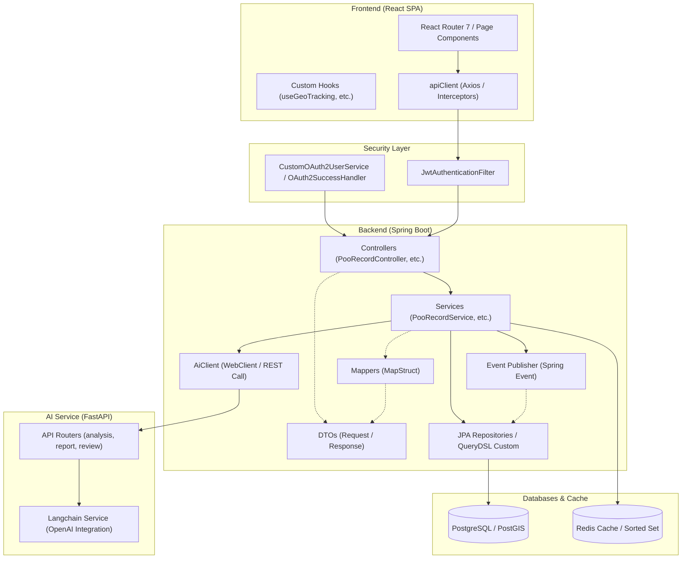
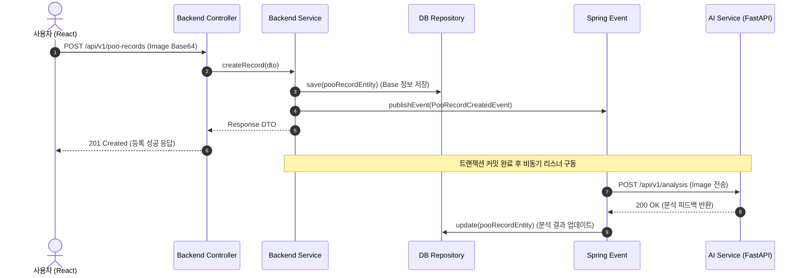

# ⚙️ DayPoo 프로젝트 종합 아키텍처 블루프린트 (Project Architecture Blueprint)

본 문서는 DayPoo 프로젝트의 전반적인 시스템 아키텍처, 구성요소, 데이터 흐름, 배포 사양 및 개발 규칙을 정의합니다. 본 문서는 프로젝트의 일관성을 유지하고 향후 신규 개발 시 가이드라인 역할을 하기 위해 작성되었습니다.

> **AI 서비스에 관한 주의**: 본 문서에 서술된 AI 서비스(FastAPI + Langchain)는 원본 팀 프로젝트의 계획 사양이며, 현재 저장소에는 구현되어 있지 않습니다. `frontend/`, `backend/`, `terraform/`, `twa/` 만 실재하고, 배변 패턴 리포트는 백엔드의 통계 계산(`ReportService`)으로 생성됩니다. AI 서비스가 등장하는 다이어그램과 절차는 향후 계획으로 읽어 주십시오.

---

## 1. 아키텍처 개요 (Architectural Overview)

DayPoo 프로젝트는 멀티티어 모노레포(Monorepo) 구조로 구성되어 있으며, 크게 세 가지 주요 서비스 레이어로 분리되어 상호작용합니다.

```
                  [ Client / Frontend (React SPA) ]
                                 │
                     HTTP / REST │ (JSON, Auth Header)
                                 ▼
              [ Business / Backend (Spring Boot API) ]
                 │                               │
       SQL / Spatial 쿼리                        │ HTTP (REST)
                 ▼                               ▼
       [ Database / Storage ]          [ AI Service (FastAPI) ]
    (PostgreSQL / PostGIS, Redis)          (Langchain + OpenAI)
```

### 아키텍처 설계 원칙

1. **단방향 의존성**: 의존성은 상위 레이어에서 하위 레이어로만 흐르며 역방향 의존성이나 순환 의존성은 허용되지 않습니다.
2. **책임의 분리 (SOC)**: 화면 프레젠테이션(React), 트랜잭션 및 비즈니스 제어(Spring Boot), 그리고 무거운 LLM 기반 AI 추론(FastAPI)의 책임을 계층별로 격리합니다.
3. **영속성 객체 격리**: 엔티티(Entity) 객체가 프레젠테이션 레이어(Controller) 외부로 노출되지 않도록 하며, 클라이언트와의 데이터 송수신에는 반드시 DTO(Data Transfer Object)를 사용합니다.
4. **결합도 완화**: 백엔드 내부 연동(예: 배변 기록 저장 후 AI 분석 트리거) 시 스프링 이벤트를 활용해 클래스 간의 강한 결합을 피합니다.
5. **데이터 프라이버시 (이미지 비저장 원칙)**: 배변 이미지 분석 시 클라이언트가 보낸 이미지 데이터는 디스크나 DB에 영구 저장하지 않고, 분석 API 요청 직후 즉시 분석 결과만 영속화합니다.

---

## 2. 아키텍처 시각화 (Visualization)

### 2.1 전체 시스템 토폴로지 및 컴포넌트 의존성


```mermaid
graph TD
    subgraph Frontend_App ["Frontend (React SPA)"]
        React["React Router 7 / Page Components"]
        Hooks["Custom Hooks (useGeoTracking, etc.)"]
        ClientAPI["apiClient (Axios / Interceptors)"]
    end

    subgraph Security_Layer ["Security Layer"]
        Filter["JwtAuthenticationFilter"]
        OAuth["CustomOAuth2UserService / OAuth2SuccessHandler"]
    end

    subgraph Backend_App ["Backend (Spring Boot)"]
        Controller["Controllers (PooRecordController, etc.)"]
        DTO["DTOs (Request / Response)"]
        Service["Services (PooRecordService, etc.)"]
        Mapper["Mappers (MapStruct)"]
        Event["Event Publisher (Spring Event)"]
        AIClient["AiClient (WebClient / REST Call)"]
        Repo["JPA Repositories / QueryDSL Custom"]
    end

    subgraph AI_Service_App ["AI Service (FastAPI)"]
        Router["API Routers (analysis, report, review)"]
        LChain["Langchain Service (OpenAI Integration)"]
    end

    subgraph Databases ["Databases & Cache"]
        DB[(PostgreSQL / PostGIS)]
        Redis[(Redis Cache / Sorted Set)]
    end

    %% Flow lines
    React --> ClientAPI
    ClientAPI --> Filter
    OAuth --> Controller
    Filter --> Controller
    Controller -.-> DTO
    Controller --> Service
    Service -.-> Mapper
    Mapper -.-> DTO
    Service --> Repo
    Service --> Event
    Service --> AIClient
    Service --> Redis
    AIClient --> Router
    Router --> LChain
    Repo --> DB
    Event -.-> Repo
```

### 2.2 실시간 배변 기록 및 AI 비동기 분석 시퀀스


```mermaid
sequenceDiagram
    autonumber
    actor User as 사용자 (React)
    participant Ctrl as Backend Controller
    participant Svc as Backend Service
    participant Repo as DB Repository
    participant Evt as Spring Event
    participant AI as AI Service (FastAPI)

    User->>Ctrl: POST /api/v1/poo-records (Image Base64)
    Ctrl->>Svc: createRecord(dto)
    Svc->>Repo: save(pooRecordEntity) (Base 정보 저장)
    Svc->>Evt: publishEvent(PooRecordCreatedEvent)
    Svc-->>Ctrl: Response DTO
    Ctrl-->>User: 201 Created (등록 성공 응답)

    Note over Svc, AI: 트랜잭션 커밋 완료 후 비동기 리스너 구동
    Evt->>AI: POST /api/v1/analysis (Image 전송)
    AI-->>Evt: 200 OK (분석 피드백 반환)
    Evt->>Repo: update(pooRecordEntity) (분석 결과 업데이트)
```

---

## 3. 서비스 레이어별 구조 및 명세

### 3.1 프론트엔드 (frontend)
React 19.2.0, Vite 7.3.1 기반 SPA 구조입니다. 스타일링에는 TailwindCSS 4.2.1, 린팅/포맷팅에는 Biome 1.9.4가 사용됩니다.

- **디렉토리 구조**:
  - `src/components/`: 재사용 컴포넌트 (예: `AuthModal`, `LocationConsentBanner`)
  - `src/context/`: 전역 상태 컨텍스트 (예: `AuthContext`, `ToiletContext` 지도 및 화장실 상태 관리)
  - `src/hooks/`: 공통 커스텀 훅 (예: `useGeoTracking` 위치 추적 로직, `useRankings` 랭킹 상태 제어)
  - `src/pages/`: 각 라우트별 페이지 컴포넌트
  - `src/services/`: API 호출 클래스 및 Axios 설정 (`apiClient.ts` 공통 interceptor 설정)
  - `src/types/`: TypeScript 타입 정의 파일
  - `src/utils/`: 헬퍼 유틸리티 함수들

- **프론트엔드 통신 패턴**:
  - `apiClient.ts`가 API base URL과 Request/Response 인터셉터를 관리합니다.
  - 요청 헤더에 JWT 토큰을 자동으로 주입하며, 401 Unauthorized 발생 시 리프레시 토큰을 이용한 재인증을 수행합니다.

- **린트/포맷 룰**:
  - Biome 설정을 기반으로 하며, 커밋 전 스테이징 영역의 파일들에 대해 자동으로 format/lint 검사를 구동합니다.

---

### 3.2 백엔드 (backend)
Spring Boot 3.4.3 및 Java 21 기반 애플리케이션으로, Gradle 빌드 툴을 사용합니다.

- **디렉토리 구조 (`com.daypoo.api`)**:
  - `controller`: HTTP 요청 수신, API 파라미터 유효성 검증 (`@Valid`), 응답 DTO 포맷팅을 수행합니다.
  - `dto`: 요청/응답 형식 정의. 엔티티 정보 노출 최소화를 위해 Layer 간 전송용 DTO를 엄격하게 격리합니다.
  - `service`: 트랜잭션 경계(`@Transactional`) 내에서 핵심 비즈니스 규칙과 로직을 수행합니다.
  - `repository`: JPA 인터페이스 및 QueryDSL 커스텀 구현체를 이용한 DB 조회.
  - `entity`: JPA 매핑 도메인 객체로 `BaseTimeEntity`를 상속합니다.
  - `mapper`: MapStruct 라이브러리를 활용해 Entity <-> DTO 자동 매핑 코드를 생성합니다.
  - `event`: 스프링 애플리케이션 이벤트를 정의하고 `@TransactionalEventListener`를 통해 이벤트를 비동기로 수신합니다.
  - `security`: Spring Security 필터 설정, JWT 토큰 파싱/생성 및 OAuth2 소셜 로그인 연동을 전담합니다.

- **핵심 패키지 규칙**:
  - `@Transactional(readOnly = true)`: 읽기 전용 서비스 로직에는 반드시 readOnly 옵션을 주어 하이버네이트 스냅샷 생성 비용을 절감합니다.
  - 리포지토리 인터페이스에 QuerydslPredicateExecutor를 결합하거나 Custom Repository 아키텍처를 도입하여 동적 쿼리를 관리합니다.

---

### 3.3 AI 서비스 (ai-service) — 미구현 계획
FastAPI 및 Python 3.12 기반의 LLM 오케스트레이션 서비스로 계획되었으나, 현재 저장소에는 해당 모듈이 존재하지 않습니다.

- **디렉토리 구조 (`app`)**:
  - `api/v1/endpoints/`: 라우터 모듈 (`analysis.py` 배변 이미지 분석, `report.py` 리포트 생성, `review.py` 코멘트)
  - `core/`: 전역 설정 및 환경 변수 바인딩 (`config.py` - Pydantic Settings 사용)
  - `schemas/`: Pydantic 모델을 이용한 Request/Response 데이터 직렬화 및 유효성 검증
  - `services/`: Langchain 기반의 prompt 템플릿 처리 및 OpenAI 비즈니스 로직 연동

- **특성**:
  - 다량의 이미지/텍스트 비동기 처리를 위해 `async/await` 패턴을 준수합니다.
  - 백엔드 서비스의 비동기 요청을 받기 때문에, 오류 발생 시 추적을 용이하게 하기 위해 `X-Correlation-Id` 헤더를 로깅 라이브러리(`loguru`)를 통해 전파합니다.

---

## 4. 데이터 아키텍처 (Data Architecture)

### 4.1 공간 데이터 모델 (PostGIS)
GPS 좌표 기반 화장실 검색 기능의 계산 병목을 방지하기 위해 PostgreSQL 공간 인덱스(GIST)를 활용합니다.
- `Toilet` 테이블의 `location` 컬럼은 PostGIS `GEOMETRY(Point, 4326)` 타입으로 매핑됩니다.
- 인접 화장실 조회를 위해 `ST_DWithin` 연산을 수행하여 인덱스를 타고 반경 내의 레코드만 빠르게 여과합니다.
- 사용자가 화장실 반경 50m 이내에 도달했는지 확인하는 GPS 방문 인증 로직이 이 계층에서 구현됩니다.

### 4.2 캐시 및 데이터 구조 (Redis)
- **실시간 글로벌 및 지역 랭킹**: Redis의 `Sorted Set` 구조를 사용하여 실시간 경험치(EXP) 및 활동 점수를 정렬하여 쿼리 오버헤드 없이 랭킹 시스템을 운영합니다.
- **인증 토큰 블랙리스트**: 로그아웃 처리되거나 탈취 가능성이 있는 JWT Access Token을 만료 시점까지 Redis에 캐싱하여 API 접근을 원천 차단합니다.
- **API Rate Limiting**: Redis의 카운터를 사용하여 단시간 내 임의의 공격성 트래픽(메일 전송, 인증 시도)을 제한합니다.

---

## 5. 횡단 관심사 구현 (Cross-Cutting Concerns)

### 5.1 인증 & 인가 (Security)
Spring Security 및 JWT를 결합한 인증 모델입니다.
1. 소셜 로그인(Google, Kakao) 성공 시 `OAuth2SuccessHandler`가 호출되어 Access 및 Refresh Token을 발행합니다.
2. 클라이언트는 모든 API 헤더의 `Authorization: Bearer <Access Token>` 형태로 보안 리소스에 접근합니다.
3. `JwtAuthenticationFilter`가 토큰을 디코딩하고 `SecurityContextHolder`에 사용자의 Principal과 GrantedAuthority를 바인딩합니다.
4. 만약 시스템 점검 모드가 활성화되면 `MaintenanceModeFilter`가 가동되어 관리자 이외의 일반 API 요청을 503 Service Unavailable로 조기 차단합니다.

### 5.2 글로벌 예외 처리
- **백엔드**: `@RestControllerAdvice`인 `GlobalExceptionHandler`가 비즈니스 예외(`BusinessException`, `EntityNotFoundException` 등)를 포착하여 표준 규격인 `ErrorResponse` DTO로 변환하여 전송합니다.
- **AI 서비스**: FastAPI Exception Handler를 사용하여 Pydantic validation 에러와 OpenAI API 호출 실패 등을 감지하고 정형화된 JSON 에러 구조로 변환합니다.
- **프론트엔드**: React의 `ErrorBoundary`가 예기치 못한 컴포넌트 트리 내 크래시를 방지하고 UI 대안을 렌더링합니다.

### 5.3 로깅 및 분산 트레이싱
- 클라이언트로부터 들어온 HTTP 요청의 Unique ID(`X-Correlation-Id`)를 Spring Boot Mapped Diagnostic Context(MDC)와 FastAPI `loguru` 컨텍스트에 설정하여, 하나의 트랜잭션이 여러 분산 서버 간에 이동하더라도 동일한 트레이스 키로 디버깅 가능하도록 보장합니다.

---

## 6. 배포 및 인프라 아키텍처 (Deployment Architecture)

DayPoo 프로젝트는 OCI(Oracle Cloud Infrastructure) 프리티어 **ARM64** 호스트 환경에 Docker Compose로 구성되어 있습니다.

```
       [ Client HTTPS Request ]
                  │
                  ▼
         [ Host OCI VM Firewall ] (Ports: 80 / 443 Ingress)
                  │
                  ▼
         [ docker-compose.prod ]
           ├── Nginx (Reverse Proxy & Frontend Dist static files)
           ├── DayPoo Backend JVM (Port 8080)
           ├── DayPoo AI Service FastAPI (Port 8000)
           ├── PostgreSQL (PostGIS) Container
           └── Redis Container
```

### 6.1 크로스 아키텍처 멀티 플랫폼 빌드
GitHub Actions의 기본 Runner는 AMD64 아키텍처이나 target 호스트는 ARM64입니다. 에뮬레이션 빌드 성능 향상을 위해 Docker Multi-stage Build 시 **컴파일 단계 분리** 방안을 적용합니다.
- **백엔드/프론트엔드 빌드 스테이지**: `--platform=$BUILDPLATFORM` 지시자를 통해 Java 바이트코드 컴파일 및 Node.js React 빌드를 호스트 아키텍처(AMD64)에서 즉각 수행하여 CPU 지연을 피합니다.
- **패키징 스테이지**: 최종 구동용 이미지 배포 단계에만 타겟 아키텍처인 `amazoncorretto:21-alpine` 및 `nginx:alpine`을 ARM64로 패키징하여 배포합니다.

### 6.2 OCI 호스트 트러블슈팅 가이드
- **OOM 장애 예방**: 백엔드 JVM 힙 메모리를 `-Xmx384m -Xms256m`으로 명시적으로 제한하고 호스트 우분투 상에서 **Swap Memory (2GB 이상)** 설정을 적용합니다.
- **네트워크 방화벽 차단**: 인스턴스에서 애플리케이션 포트 포워딩이 정상이어도 외부 접속 지연이 있으면 OCI VCN의 수신 보안 규칙 및 호스트 OS 방화벽(`iptables` 내 `INPUT` 체인 정책)에 80 및 443 포트 개방 설정이 유효한지 검증합니다.

---

## 7. 신규 개발을 위한 블루프린트 (Blueprint for New Development)

신규 비즈니스 요구사항이나 도메인을 작성하는 경우 다음 단계를 필히 준수합니다.

### 7.1 백엔드 개발 절차 및 템플릿

#### 1단계: Entity 선언
데이터베이스 테이블 모델링을 반영하여 엔티티를 설계합니다.

```java
package com.daypoo.api.entity;

import jakarta.persistence.*;
import lombok.*;

@Entity
@Table(name = "features")
@Getter
@NoArgsConstructor(access = AccessLevel.PROTECTED)
@AllArgsConstructor
@Builder
public class Feature extends BaseTimeEntity {
    @Id
    @GeneratedValue(strategy = GenerationType.IDENTITY)
    private Long id;

    @Column(nullable = false)
    private String title;
}
```

#### 2단계: Repository 생성
기본 CRUD 처리를 위해 JPA 인터페이스를 상속합니다.

```java
package com.daypoo.api.repository;

import com.daypoo.api.entity.Feature;
import org.springframework.data.jpa.repository.JpaRepository;
import org.springframework.stereotype.Repository;

@Repository
public interface FeatureRepository extends JpaRepository<Feature, Long> {
}
```

#### 3단계: DTO 정의
Request와 Response의 목적에 부합하도록 정적 중첩 클래스로 명명합니다.

```java
package com.daypoo.api.dto;

import jakarta.validation.constraints.NotBlank;
import lombok.*;

public class FeatureDto {
    @Getter
    @NoArgsConstructor
    @AllArgsConstructor
    @Builder
    public static class Request {
        @NotBlank(message = "제목은 필수입니다.")
        private String title;
    }

    @Getter
    @AllArgsConstructor
    @Builder
    public static class Response {
        private Long id;
        private String title;
    }
}
```

#### 4단계: MapStruct Mapper 매핑
객체 변환 레이어 생성을 인터페이스로 정의합니다.

```java
package com.daypoo.api.mapper;

import com.daypoo.api.dto.FeatureDto;
import com.daypoo.api.entity.Feature;
import org.mapstruct.Mapper;

@Mapper(componentModel = "spring")
public interface FeatureMapper {
    Feature toEntity(FeatureDto.Request request);
    FeatureDto.Response toDto(Feature entity);
}
```

#### 5단계: Service 작성 및 Transaction 바인딩
핵심 비즈니스 흐름을 정의합니다.

```java
package com.daypoo.api.service;

import com.daypoo.api.dto.FeatureDto;
import com.daypoo.api.entity.Feature;
import com.daypoo.api.mapper.FeatureMapper;
import com.daypoo.api.repository.FeatureRepository;
import lombok.RequiredArgsConstructor;
import org.springframework.stereotype.Service;
import org.springframework.transaction.annotation.Transactional;

@Service
@RequiredArgsConstructor
public class FeatureService {
    private final FeatureRepository repository;
    private final FeatureMapper mapper;

    @Transactional
    public FeatureDto.Response saveFeature(FeatureDto.Request request) {
        Feature saved = repository.save(mapper.toEntity(request));
        return mapper.toDto(saved);
    }
}
```

#### 6단계: Controller 노출 및 Validation
외부 엔드포인트를 노출합니다.

```java
package com.daypoo.api.controller;

import com.daypoo.api.dto.FeatureDto;
import com.daypoo.api.service.FeatureService;
import jakarta.validation.Valid;
import lombok.RequiredArgsConstructor;
import org.springframework.http.HttpStatus;
import org.springframework.http.ResponseEntity;
import org.springframework.web.bind.annotation.*;

@RestController
@RequestMapping("/api/v1/features")
@RequiredArgsConstructor
public class FeatureController {
    private final FeatureService service;

    @PostMapping
    public ResponseEntity<FeatureDto.Response> create(@RequestBody @Valid FeatureDto.Request request) {
        return ResponseEntity.status(HttpStatus.CREATED).body(service.saveFeature(request));
    }
}
```

---

### 7.2 프론트엔드 개발 절차

1. **타입 정의**: `src/types/` 내에 API 인터페이스 명세에 맞는 TypeScript 타입을 사전 작성합니다.
2. **API 서비스 작성**: `src/services/` 디렉토리 하위에 apiClient를 임포트하여 백엔드 호출 메서드를 작성합니다.
3. **커스텀 훅 및 상태 설계**: 컴포넌트의 렌더링 부하와 로직 분리를 위해 `useAsyncState` 등을 활용해 API 호출을 제어하는 훅을 설계합니다.
4. **컴포넌트/페이지 구현**: JSX 마크업을 작성하고 화면을 구성합니다. 과도한 애니메이션이나 CSS 스타일 추가를 금지하며 심플하고 직관적인 UI 컨벤션을 유지합니다.
5. **라우터 연동**: `src/App.tsx` 내에 레이지 로딩(`lazy`) 형태로 신규 경로를 할당합니다.

---

### 7.3 AI 서비스 엔드포인트 개발 절차 — 미구현 계획

1. **Pydantic 스키마 정의**: `app/schemas/` 에 데이터 유효성 및 파싱 필드 사양을 선언합니다.
2. **라우터 생성**: `app/api/v1/endpoints/` 에 신규 파이썬 파일을 추가하고 라우트 함수(`@router.post(...)`)를 작성합니다.
3. **핵심 분석 서비스 구현**: `app/services/` 내에서 Langchain의 LLMChain 혹은 prompt template을 조립하고 응답 형식을 설정합니다.
4. **메인 인스턴스 등록**: `app/main.py`에 라우터를 등록합니다.
5. **테스트 작성**: `pytest`를 활용하여 모의 AI 호출 및 Pydantic validation 테스트를 배치합니다.

---

## 8. 아키텍처 준수 및 테스트 규정

1. **테스트 코드 동시 배치**: 새로운 클래스나 비즈니스 기능을 정의할 시 반드시 타겟 코드와 인접한 디렉토리에 테스트 코드 파일(FE는 Vitest, BE는 JUnit, AI는 Pytest)을 동시 생성해야 합니다.
2. **린터 및 포매터 준수**: 모든 수정사항을 적용한 후에는 FE는 `npm run check`(또는 `biome check`), BE는 `./gradlew spotlessApply`, AI는 `black`과 `isort` 규칙을 실행하여 코드 컨벤션 위반이 없는지 빌드 전 자율 점검합니다.
3. **임의의 모듈 임포트 금지**: 순방향 아키텍처 흐름(`Controller -> Service -> Repository`)을 위반하는 결합(예: Entity가 API 레이어에 직접 참조되거나, 프론트엔드가 하드코딩된 테마 상수를 남발하는 것)을 엄격히 금지합니다.
