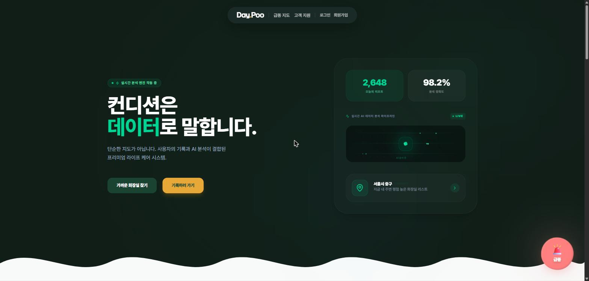
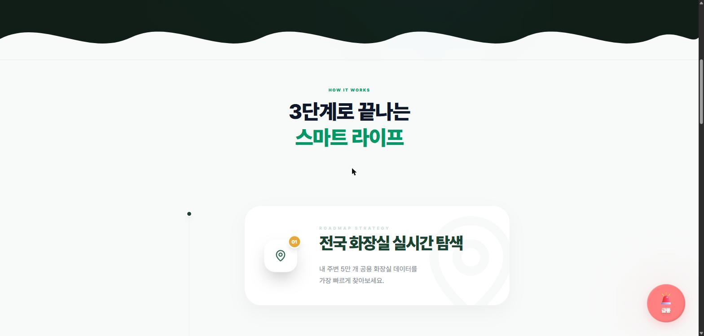
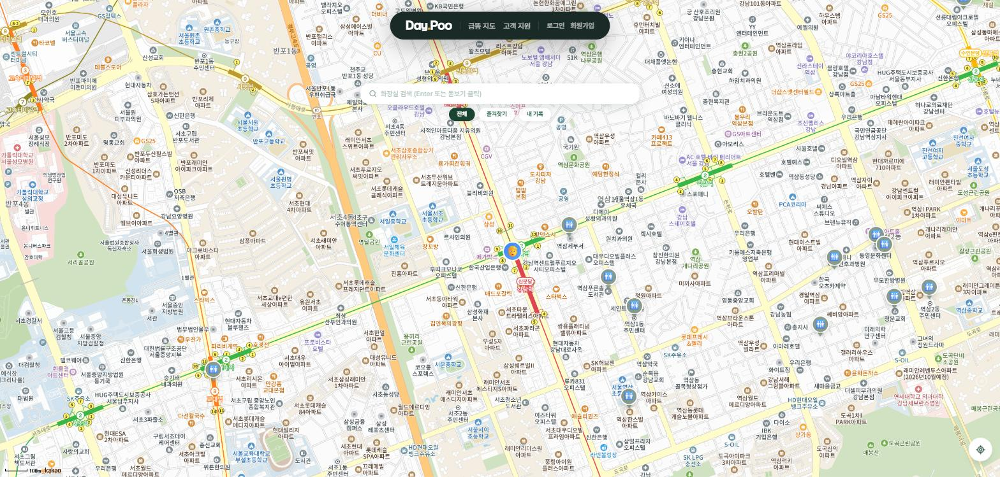
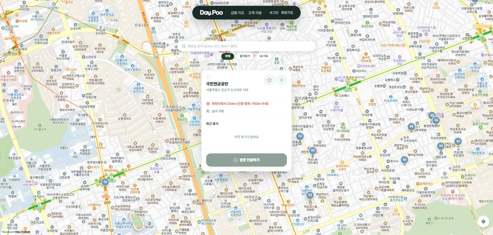
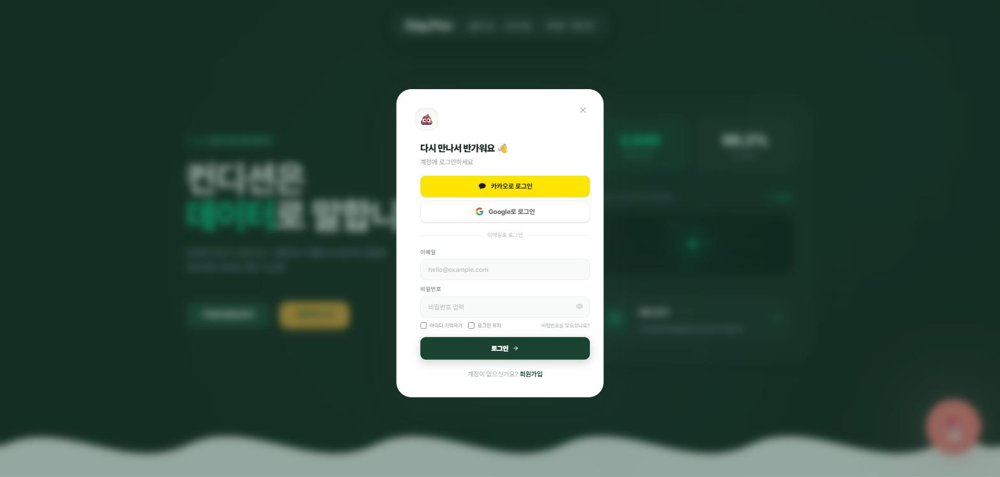
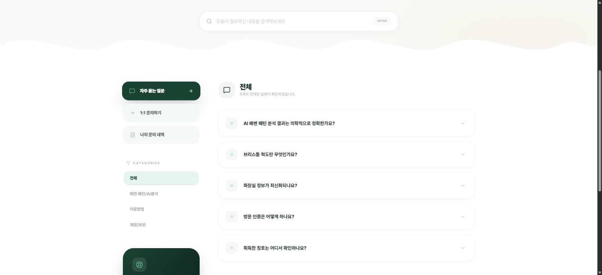
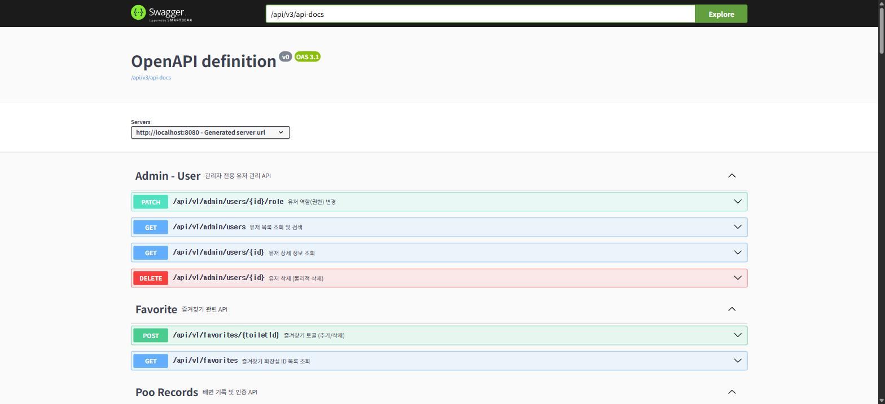

# 로컬 실행 및 화면 가이드

로컬에서 DayPoo를 기동해 실제 화면을 확인하는 절차와, 각 화면에서 무엇을 볼 수 있는지 정리한 문서다.
아래 스크린샷은 모두 2026-08-27 기준으로 로컬 환경에서 직접 촬영했다.

## 1. 실행 절차

실행 순서는 DB → 백엔드 → 프론트엔드다. 루트 `.env` 하나를 세 곳(docker-compose, 백엔드, 프론트엔드)이 공유한다.

로컬 포트는 다른 프로젝트와 겹치지 않도록 다음 값으로 고정되어 있다. 별도의 환경 변수를 지정할 필요가 없다.

| 구성 요소 | 로컬 포트 | 고정 위치 |
|---|---|---|
| 프론트엔드(Vite) | 5173 | `frontend/vite.config.ts` 의 `server.port` 와 `strictPort: true` |
| 백엔드(Spring Boot) | 18080 | `backend/build.gradle` 의 `bootRun` 태스크가 `SERVER_PORT=18080` 을 주입한다 |
| PostgreSQL(PostGIS) | 15432 | `docker-compose.yml` 의 `${DB_PORT:-15432}` 와 루트 `.env` 의 `DB_PORT` |
| Redis | 16379 | `docker-compose.yml` 의 `${REDIS_PORT:-16379}` 와 루트 `.env` 의 `REDIS_PORT` |

프론트엔드만 5173 으로 고정한 이유가 다르다. 카카오맵 SDK는 개발자 콘솔에 등록된 `http://localhost:5173` 출처에서만 로드되므로 포트를 바꿀 수 없다. `strictPort: true` 를 두었기 때문에 5173 이 이미 점유되어 있으면 Vite가 다른 포트로 옮겨가지 않고 즉시 실패한다. 지도가 빈 화면이 되는 대신 실행 단계에서 문제가 드러난다.

DB 와 Redis 의 포트는 루트 `.env` 의 `DB_PORT`·`REDIS_PORT` 가 있으면 그 값이 우선한다. 예전 값(5432·6379)이 남아 있다면 `.env.example` 과 같은 값(15432·16379)으로 바꿔야 한다. 백엔드도 같은 파일을 읽으므로 컨테이너 포워딩 포트와 접속 포트가 함께 움직인다.

```bash
# 1. 인프라 (PostgreSQL + PostGIS, Redis)
docker compose up -d

# 2. 백엔드 (:18080)
cd backend && ./gradlew bootRun

# 3. 프론트엔드 (:5173)
cd frontend && npm run dev
```

기동이 끝나면 다음 두 곳에서 상태를 확인한다.

- 헬스체크: `http://localhost:18080/actuator/health` — `db`, `redis` 가 모두 `UP` 이어야 한다.
- Swagger UI: `http://localhost:18080/api/docs`

### 실행 전 확인할 것

| 항목 | 확인 방법 | 어긋났을 때 나타나는 증상 |
|---|---|---|
| 루트 `.env` 의 `DB_PORT`·`REDIS_PORT` 가 15432·16379 인지 | 해당 파일 확인 | 컨테이너가 예전 포트로 열려 다른 프로젝트의 PostgreSQL·Redis 와 충돌한다 |
| 15432 포트를 Docker 컨테이너가 점유하는지 | `netstat -ano \| findstr :15432` 로 확인한 PID의 프로세스가 `wslrelay` 인지 (WSL2 Docker 사용 시) | 백엔드 부팅이 Flyway 단계에서 `password authentication failed` 로 실패한다 |
| 프론트엔드가 5173 포트를 확보했는지 | 콘솔에 출력된 Local 주소 (`strictPort` 때문에 확보하지 못하면 실행 자체가 실패한다) | 카카오맵 SDK가 등록 도메인 밖이라고 판단해 지도가 빈 화면이 된다 |

포트를 고정하기 전에는 세 가지 충돌을 반복해서 겪었다. Windows에 네이티브 PostgreSQL이 설치되어 있으면 그 인스턴스가 5432를 먼저 점유하고, 백엔드는 Docker 컨테이너가 아니라 네이티브 인스턴스에 접속한다. 그 인스턴스에는 루트 환경 변수 파일에 적힌 계정이 없으므로 인증에 실패한다. 백엔드 8080 은 다른 프로젝트와 겹쳤고, 이를 피하려고 8081 로 옮기자 이번에는 또 다른 프로젝트의 백엔드와 겹쳤다. 15432·16379·18080 은 이러한 기본 포트를 피해서 고른 값이다.

고정한 포트마저 다른 프로세스가 점유한 경우에는 그 프로세스를 내린 뒤 컨테이너를 다시 시작해 포트 포워딩을 재설정한다.

```bash
# 점유 프로세스 확인
netstat -ano | findstr :15432

# 네이티브 PostgreSQL 을 내려야 한다면 (설치 경로와 데이터 디렉터리는 환경에 따라 다르다)
pg_ctl -D <데이터 디렉터리> -m fast stop

# 컨테이너를 재시작해 포워딩을 다시 건다 (restart 로는 복구되지 않는 경우가 있다)
docker stop daypoo_postgres && docker start daypoo_postgres
```

### 로컬에서 동작하지 않는 기능

- **화장실 텍스트 검색** (지도 상단 검색창): OpenSearch(`localhost:9200`)에 의존하는데, 로컬 `docker-compose.yml` 에는 OpenSearch 서비스가 없다. 검색을 실행하면 백엔드가 `ToiletSearchService` 에서 연결 실패를 기록하고 빈 배열을 반환하므로, 화면에는 결과가 표시되지 않는다. 지도 마커 조회(`GET /api/v1/toilets`)는 PostGIS 공간 쿼리를 쓰므로 OpenSearch 없이도 정상 동작한다.

## 2. 화면별 사용 방법

### 2.1 메인 (`/main`)



서비스 진입점이다. `가까운 화장실 찾기` 는 지도 화면으로, `기록하러 가기` 는 배변 기록 화면으로 이동한다. 우측 하단의 `급똥` 버튼은 어느 화면에서나 지도로 바로 이동하는 단축 버튼이다.

아래로 스크롤하면 기능 소개 섹션이 이어진다.



### 2.2 급똥 지도 (`/map`)



브라우저 위치 권한을 허용하면 현재 위치를 중심으로 지도가 열리고, 반경 내 화장실이 마커로 표시된다. 지도를 이동하거나 축척을 바꾸면 그 영역을 기준으로 `GET /api/v1/toilets?latitude=..&longitude=..&radius=..` 를 다시 호출한다. 상단 필터로 `전체 / 즐겨찾기 / 내 기록` 을 전환할 수 있다.

마커를 클릭하면 상세 패널이 열린다.



패널에는 이름, 주소, 현위치로부터의 거리, 남녀 구분 여부, 최근 후기가 표시된다. `방문 인증하기` 는 인증 범위(현위치에서 150m 이내)에 들어와 있을 때만 동작하며, 로그인이 필요하다.

### 2.3 로그인·회원가입



로그인은 별도 페이지가 아니라 모달로 열린다. 헤더의 `로그인` 을 누르거나, 로그인이 필요한 화면(마이페이지 등)에 접근하면 자동으로 뜬다. 카카오·구글 소셜 로그인과 이메일 로그인을 지원한다.

소셜 로그인을 로컬에서 쓰려면 `.env` 에 각 제공자의 클라이언트 ID와 시크릿이 있어야 한다. 값이 없으면 인증 실패 후 `?error=` 파라미터를 달고 돌아오며, 화면에 설정 누락 안내가 표시된다.

### 2.4 고객 지원 (`/support`)



자주 묻는 질문, 1:1 문의하기, 나의 문의 내역으로 구성된다. 좌측 `CATEGORIES` 에서 `배변 패턴/AI분석`, `이용방법`, `계정/보안` 으로 질문을 걸러 볼 수 있다. 1:1 문의 작성과 문의 내역 조회는 로그인이 필요하다.

### 2.5 API 문서 (`http://localhost:18080/api/docs`)



백엔드 기동 후 Swagger UI에서 전체 엔드포인트를 확인하고 직접 호출해 볼 수 있다. OpenAPI JSON은 `/api/v3/api-docs` 에 있다.

## 3. 이 문서에 포함하지 않은 화면

다음 화면은 로그인한 계정이 필요해 촬영하지 않았다. 계정을 만든 뒤 같은 방식으로 추가하면 된다.

- 마이페이지 (`/mypage`) — 배변 기록 달력, AI 분석 리포트, 획득 칭호
- 관리자 (`/admin`) — 유저 관리, 문의 관리, 시스템 설정. `ADMIN` 역할을 가진 계정만 접근할 수 있고, 그 외 계정은 `/main` 으로 리다이렉트된다
